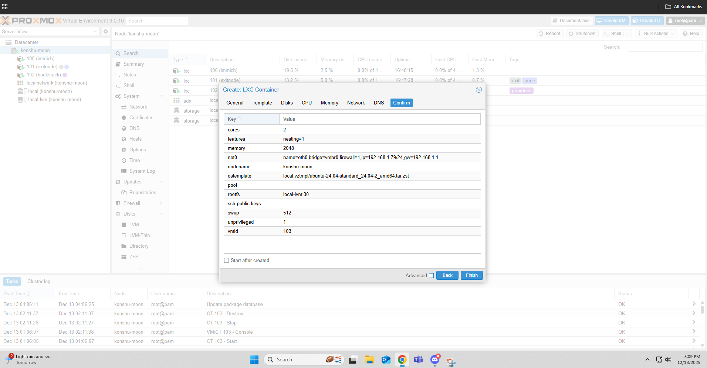
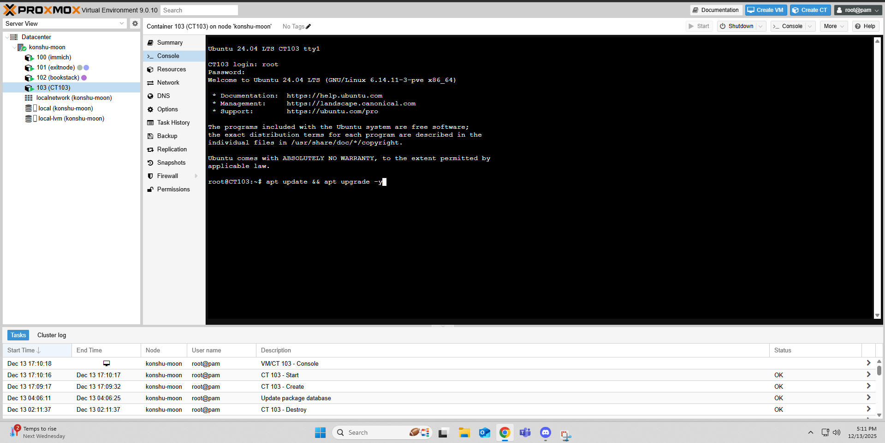
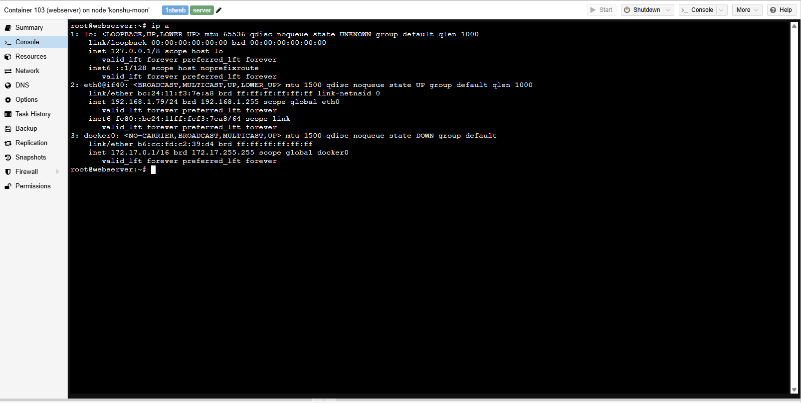
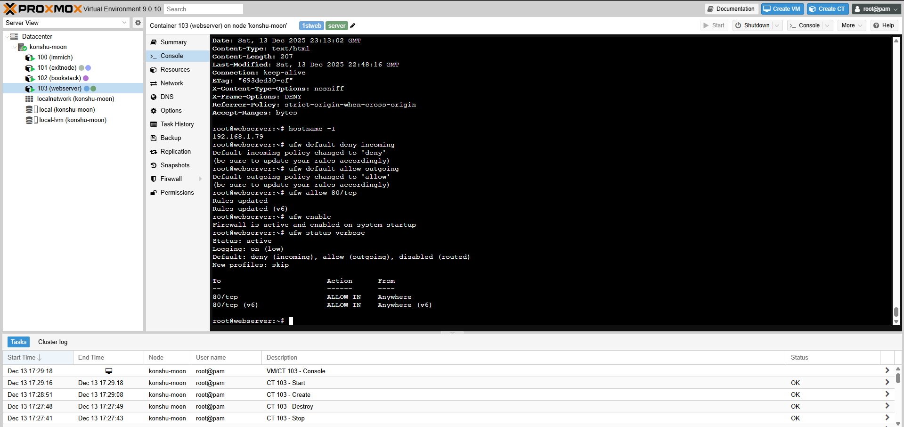
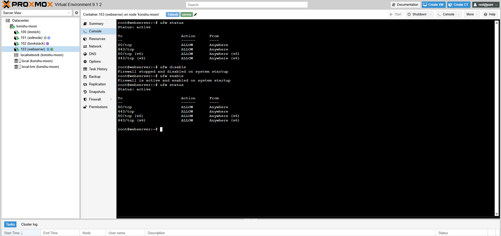
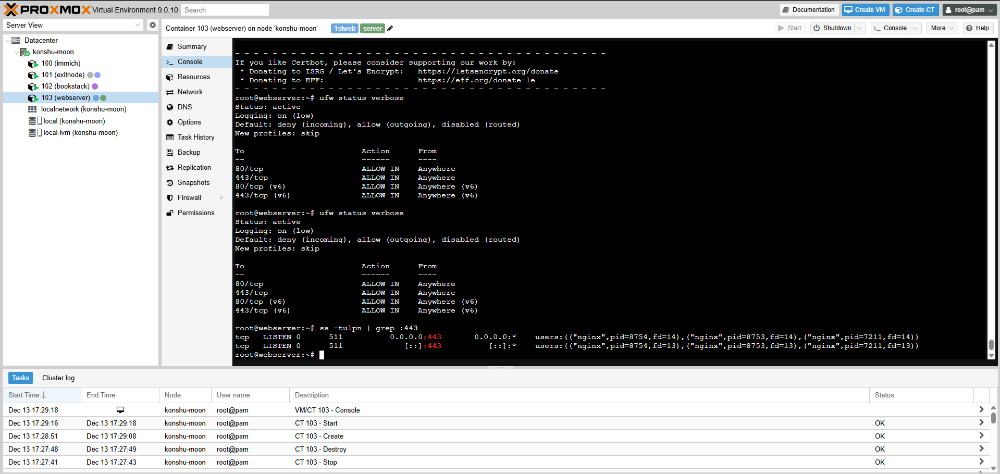
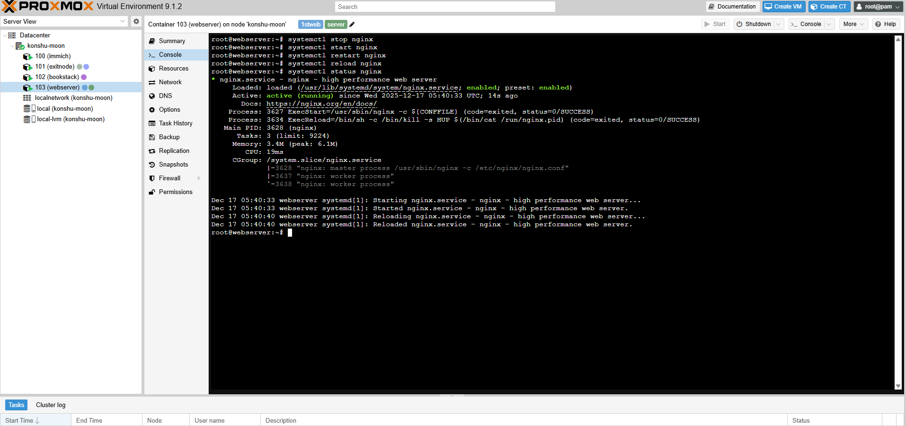
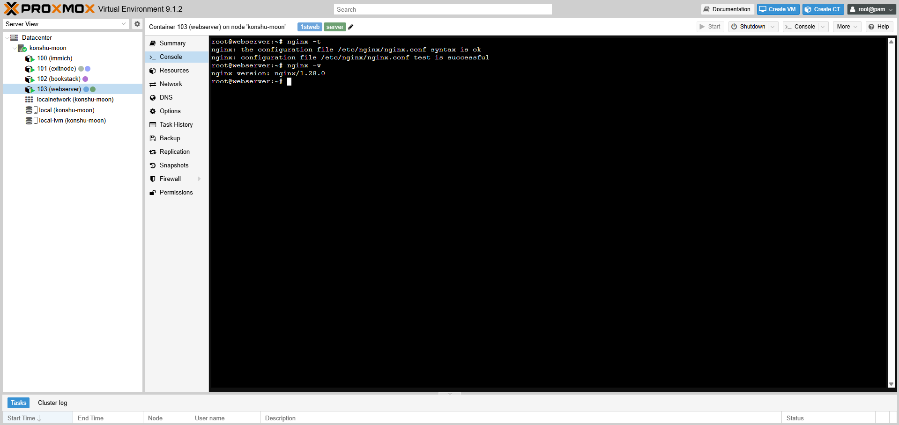
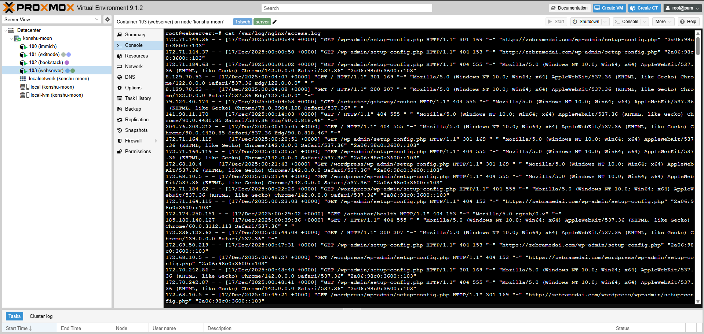
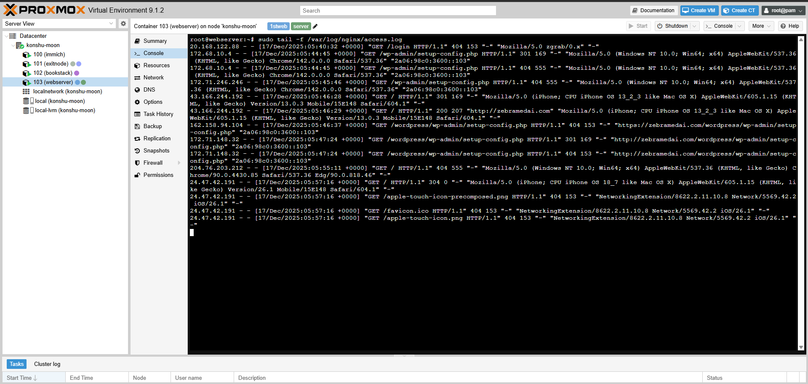

# Server Hardware, LXC, Firewall, and Nginx Documentation

## What are the server hardware specifications (LXC settings)?

My web server is running inside an **LXC container on Proxmox**, which uses shared kernel virtualization. Here are the specs:

- **CPU:** 2 vCPU (enough for a static or low-traffic site)
- **Memory:** 2 GB RAM
- **Storage:** 30 GB disk
- **Network:** Bridged network (`vmbr0`)
- **Operating System:** Ubuntu 24.04 LTS

Because it is an LXC container, it is lightweight, boots fast, and uses fewer resources than a full virtual machine.

## What is the lxc login screen?

Here we have the login screen for the container that holds our server, it will look different from what you have as I am running the instance on proxmox.

## What is the IP address of your LXC server?

Inside the LXC container, you find the IP address using the command:
    ip a
This command lists all network interfaces and shows the IPv4 address assigned to the container. In this case, the LXC server is assigned a private LAN IP address (for example: `192.168.1.79/24`).

## How do you work with the Firewall in Proxmox and the LXC?

Firewall management happens at **two layers**:

- Proxmox firewall (host / datacenter / node / container level)
- Firewall inside the LXC container (UFW)

Inside the LXC, you used **UFW (Uncomplicated Firewall)**, which is a frontend for `iptables`. UFW are rules that also come pre-installed in Ubuntu. 

## Common UFW commands

Here we have some commands that can be used for UFW and their explanations. I have also included a photo to show what some might look like in action.

* `sudo ufw status`  
  * Shows whether the firewall is active and lists all current rules.

* `sudo ufw enable`  
  * Enables the firewall and starts enforcing rules.

* `sudo ufw disable`  
  * Disables the firewall and stops filtering traffic.

* `sudo ufw allow 80/tcp`  
  * Allows incoming HTTP traffic on port **80**.

* `sudo ufw allow 443/tcp`  
  * Allows incoming HTTPS traffic on port **443**.

* `sudo ufw deny 8000/tcp`  
  * Blocks access to port **8000** from external sources.

## How do you check if the Firewall is running?

sudo ufw status

## How do you disable the Firewall?

sudo ufw disable

## How do you add Nginx to the Firewall?

sudo ufw allow 80/tcp
sudo ufw allow 443/tcp

Or:

sudo ufw allow 'Nginx Full'

The commands to check if the firewall is running or disabled are above but here is also a screenshot to show them.

## What different commands do we use to work with Ngnix?

Down below you will see the commands that have been used.

### Nginx service commands

sudo systemctl start nginx
sudo systemctl stop nginx
sudo systemctl restart nginx
sudo systemctl reload nginx
sudo systemctl status nginx

## Test Nginx configuration

sudo nginx -t

## Check Nginx version

nginx -v

Here we have the screenshot that displays nginx -t and nginx -v.

## Nginx configuration files

- `/etc/nginx/nginx.conf`
- `/etc/nginx/conf.d/*.conf`
- `/etc/nginx/sites-available/`
- `/etc/nginx/sites-enabled/`

## Nginx logs

- `/var/log/nginx/access.log`
- `/var/log/nginx/error.log`

## Review logs

cat /var/log/nginx/access.log
cat /var/log/nginx/error.log
tail -f /var/log/nginx/access.log
grep error /var/log/nginx/error.log

A bonus screenshot I have here is being able to see a live log of who enters our site.
