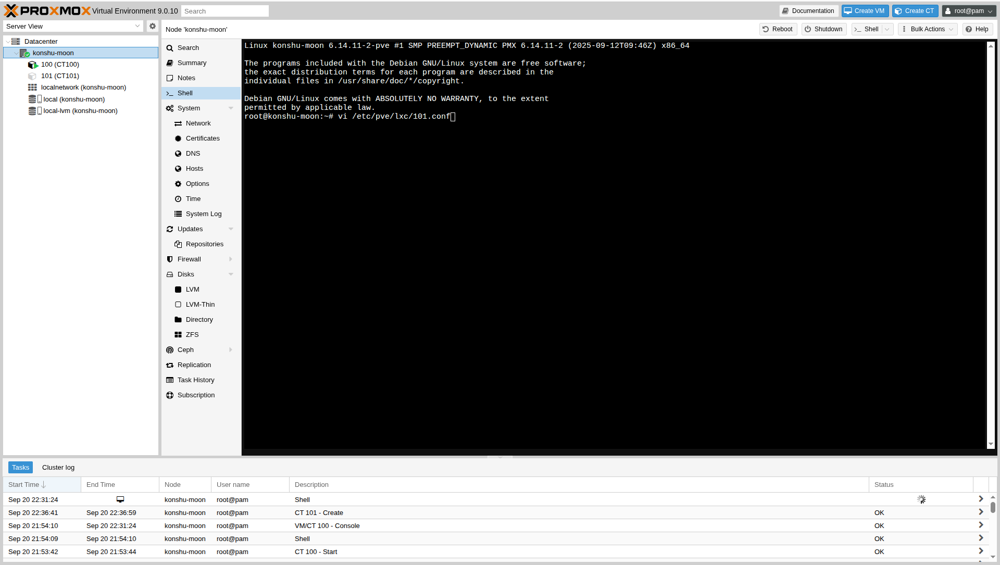
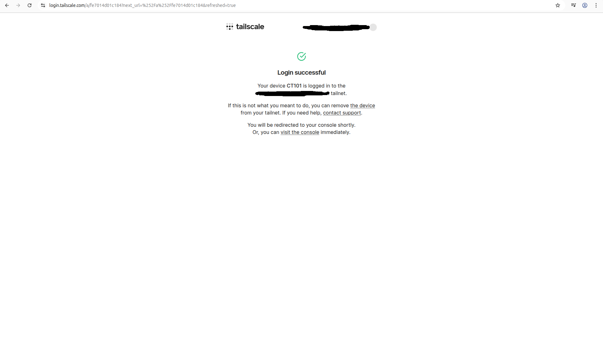

# Personal Photo Management Server with Immich

This will be a small "guide" to the installation of Tailscale and Immich.  
After some time of paying for iCloud storage and recently out of storage for Google Photos I decided to finally get rid of pay-to-play services with Immich.  

Immich is essentially a Google Photos clone but is free, open-source software that can be used on a home server to have your very own cloud with unlimited amounts of storage as long as you provide it.  

Tailscale is an open-source WireGuard-based VPN that connects users, services, and devices directly. Tailscale can be used anywhere in the world as long as you have internet access — and the best part is that it's FREE (with paid tiers available, but the free tier is more than enough for a regular user).  

---

## Specs
- Intel Core i5-7500 @ 3.40GHz  
- 8GB DDR3 RAM  
- 1TB HDD (Seagate)  
- Proxmox (OS)  

---

## LXC Container


Inside of Proxmox I made an LXC container running Ubuntu so that it can house our Immich and Docker programs.  
In my screenshot above you'll see exactly what settings I am using for this container to run Immich along with Tailscale.  

**Note:** What I'm missing in the screenshot is the DNS and IP configuration.  
- **DNS:** hostname set to host setting, DNS IP set to `1.1.1.1` (Cloudflare)  
- **IP configuration:** can be automatically set, but I opted for a static IP (easier for the Tailscale installation).  


Once the fields were filled in with our appropriate settings, we click on **Create**.  
When finished, you'll see what's shown above letting us know that our container is now ready to use.  

Before starting installations, update the container:  

```bash
apt update
apt install curl
```


---

## Tailscale Install

In our **host shell**, we need to edit a config file to let Tailscale use a tun device. Add these lines:  

```bash
lxc.cgroup2.devices.allow: c 10:200 rwm
lxc.mount.entry: /dev/net/tun dev/net/tun none bind,create=file
```

To edit the file, run the command shown in the screenshot below:  



Inside of the file, the configuration will look like this:  


Now that our config file is ready, we can install Tailscale inside the LXC container:  

```bash
curl -fsSL https://tailscale.com/install.sh | sh
```

After the installation completes, run:  

```bash
tailscale up
```

Tailscale will then present a **login link** you can open in your browser to set up Tailscale with your email.  

Screenshots below:  

  
  

---

## Docker Installation


To properly run Immich, we must first install Docker Compose.  
We’ll use the [Docker official apt repository instructions](https://docs.docker.com/engine/install/ubuntu/#install-using-the-repository).  

---

## Installing Immich

Now for the golden egg: **Immich**.  
The installation steps are available on the [Immich website](https://immich.app/docs/install/docker-compose).  

While following the steps, I ran into some confusion when editing the configuration files (not mentioned in the docs).  
To access the files, run:  

```bash
nano .env
```

Inside the editor, fill out the configuration values as shown in the screenshot below (remember to create your own password).  

  

---

## The Finished Product

After completing the installation of Docker, Tailscale (so we can access it anywhere), and Immich, the last step is the post-installation setup.  

Follow [Immich post-install instructions](https://immich.app/docs/install/post-install) to download the mobile app.  

This is what my finished product looks like:  


