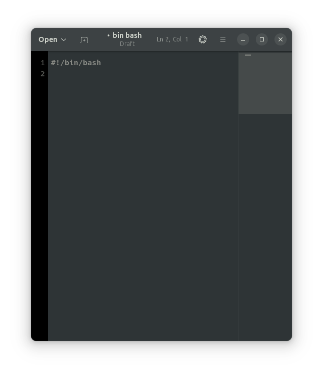

# How to install and remove software using the APT command 

Learning to use the apt command is one of the most important steps when it comes to learning Linux. The apt command is what we use to manage software packages on Debian-based distros like Ubuntu (what I use). apt has to be run inside of a terminal window, and we must use the command sudo in front of apt because that will give us the administrator privilege to do so.

Now let’s put that into practice by opening a terminal using our shortcut of Ctrl + Alt + T. Inside of this terminal we will now input the command:

  sudo apt install firefox

Running this command will then begin an installation of the app Firefox and will ask for your permission to do so.

Another great thing about the apt command and installing applications is that we can also search for what we want to install using the command:

  apt search

Removing software using the apt command can seem intimidating at first, but it's actually really simple and easy. To begin the removal of software we will use the command:

  sudo apt remove firefox

This will uninstall the software, but we will still have the files and will need to remove them to free the space up again. Files that are still left behind after the first removal is normal, and some people will leave them there permanently — but not us, since we care about what files we have that are important and unimportant. To do so we will use the command:

  sudo apt purge firefox

# How to create a shell script step by step including screenshots and how to run it.

- ## Step one 
  First we want to open our text editor and input "**#!/bin/bash**" as our first line like we have below.

- ## Step two
  After opening our text editor and writing our first line we then want to save the file as a .sh file inside of a folder in our home directory called "scripts". In our case we will name the script tutorial.sh. 

- ## Step Three
  With our script saved in our scripts folder we can now enter our line to display some text in our shell. Using the echo command we will display "Hello World". Inside of the text editor it will look like this, echo "hello world". Once we have that entered we will simple hit save this time instead of save as.

  

- ## Step Four
  The script is now saved and we can now open our terminal and run it! Inside of our terminal we will now use the command "bash scripts/tutorial.sh", once that is typed into the terminal we will hit enter. If all the steps were followed properly we can see how it executes the script with the output "hello world". 

  